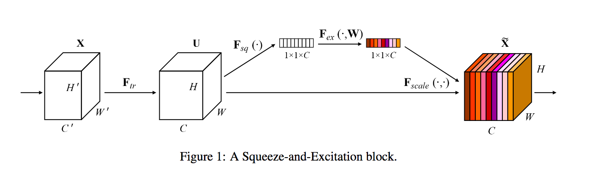

# Squeeze-Excitation Networks

Implementation of the paper [Squeeze-and-Excitation Networks](https://arxiv.org/abs/1709.01507) in Keras.



SE blocks performs *feature recalibration*. Instead of considering each channel equal to the other, the network learn to excite the needed channel.

The block itself is very simple and can implemented like this:

```python
def se_block(tensor, ratio):
    nb_channel = K.int_shape(tensor)[-1]

    x = GlobalAveragePooling2D()(tensor)
    x = Dense(nb_channel // ratio, activation='relu')(x)
    x = Dense(nb_channel, activation='sigmoid')(x)

    x = Multiply()([tensor, x])
    return x
```

It is very easy to add SE blocks to existing architectures.

- For linear architecture, simply add it after the Conv2D. This repository contains an example of `AlexNet` with SE blocks.
- For inception architecture, add the SE blocks after each inception module.
- For residual architecture, add the SE blocks in the main stream, just before adding the residual.
